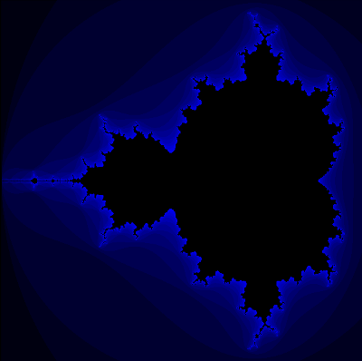

# Övning 10 uppgift

Rita upp [Mandelbrotmängden](https://en.wikipedia.org/wiki/Mandelbrot_set)!

Använd gärna kodskelettet här för att komma igång snabbt.



## Extra info för den som är intresserad

I verkligheten sparar man oftast inte pixlarna i en tvådimensionell array, detta används först och främst i denna övning för att det är lättare att visualisera och för att visa att man kan göra det. Javas `BufferedImage`-klass som används bakom kulisserna i denna övning sparar pixeldatan som en endimensionell array av typen `int[]`. Varje `int` innehåller information om pixelns RGB värden samt dess genomskinlighet (alpha).

Men hur omvandlar man då en (x,y) punkt i 2D till ett index i en endimensionell array? Lyckligtvis finns det en enkel formel:
```
index = y * bildens bredd + x
```
